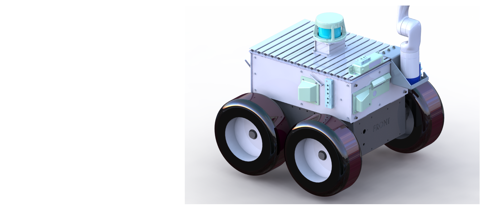
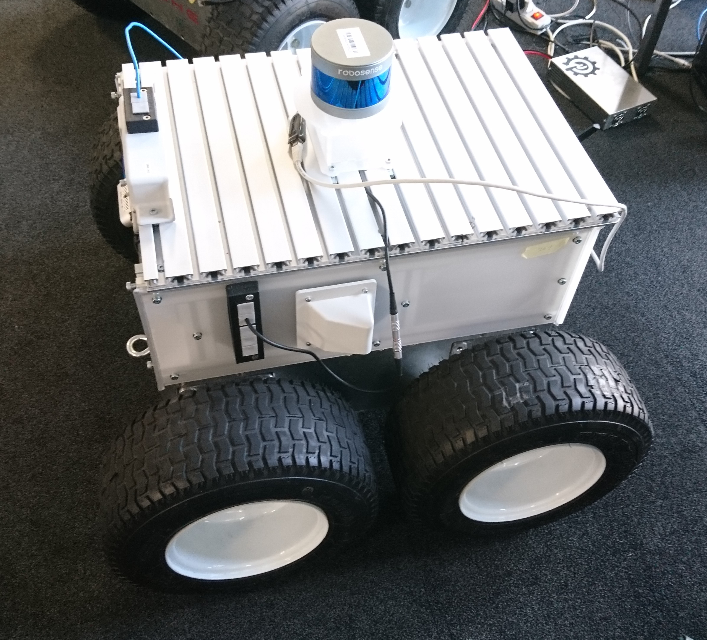

# SMB 2.0 Assembly Manual
This repo is created to explain building procedure for the  Super Mega Bots (SMBs) from ETHz RSL / ASL. Contains mainly a [Wiki](https://github.com/turcantuna/SMB_Assembly-Manual/wiki) for explanations. :robot:

  

  

